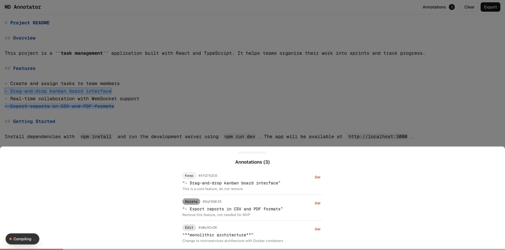

# MD Annotator

A web app for annotating Markdown documents. Select text ranges, tag them with annotation types, add instructions, and export a structured payload — designed for Claude Code handoffs.



## What It Does

MD Annotator lets you mark up a Markdown document with semantic annotations before handing it off to an AI assistant. Instead of writing long instructions, you highlight the exact text you want changed and label it.

**Five annotation types:**

| Type | Purpose | Visual Style |
|------|---------|--------------|
| **Edit** | Request a change to specific text | Dashed underline |
| **Ask** | Ask a question about specific text | Solid underline |
| **Keep** | Mark text that must not change | Outline box |
| **Delete** | Request removal of specific text | Strikethrough |
| **Note** | Attach a comment (no change needed) | Left border |

## Getting Started

### Prerequisites

- Node.js 18+
- npm

### Installation

```bash
git clone https://github.com/lukaspitter-x/md-annotator.git
cd md-annotator
npm install
npm run dev
```

Open [http://localhost:3000](http://localhost:3000) in your browser.

## How to Use

### Step 1 — Write or paste your Markdown

Type or paste Markdown content into the editor. The editor provides syntax highlighting for headings, bold, italic, code, links, lists, and blockquotes.

Your work is automatically saved to localStorage, so you can close the tab and come back later.

### Step 2 — Select text to annotate

Highlight any text range in the editor. A floating toolbar appears at the bottom of the screen showing your selection with an **Annotate** button.

### Step 3 — Choose an annotation type

Tap **Annotate** to open the annotation sheet. Pick one of the five types (edit, ask, keep, del, note) and optionally write an instruction or comment explaining what you want done.

Hit **Save** to create the annotation. The annotated text is now visually highlighted in the editor with a style matching its type.

### Step 4 — Review and manage annotations

- Click any highlighted text in the editor to jump to its annotation for editing
- Open the **Annotations** drawer (button in the header with count badge) to see all annotations listed by position
- Navigate between annotations with the **Prev/Next** buttons
- Edit the type, comment, or delete any annotation

### Step 5 — Export the payload

Click **Export** in the header to open the export drawer. The payload includes:

1. **Processing instructions** — A guide for Claude on how to interpret the annotations
2. **Annotated Markdown** — Your document with inline markers wrapping each annotated range:
   ```
   <<ANN:id=abc123 type=edit>>text to change<</ANN>>
   ```
3. **Annotation index** — A JSON block listing every annotation with its type, selected text, and comment

Use the copy buttons to grab the full payload, just the annotated markdown, or just the instructions.

### Step 6 — Hand off to Claude Code

Paste the exported payload into Claude Code. The inline markers and annotation index give Claude exact context about what you want changed, kept, questioned, or removed.

## Features

- **Autosave** — Debounced save to localStorage (1 second delay)
- **Dark mode** — Toggle via system preference, powered by next-themes
- **Mobile optimized** — Fixed viewport, safe area insets, touch-friendly targets, iOS clipboard fallback
- **No overlap** — Annotations cannot overlap; the app enforces this on creation
- **Mismatch detection** — Warns you if document edits invalidate existing annotation positions
- **Markdown syntax highlighting** — Headings, bold, italic, code blocks, links, lists, and blockquotes

## Tech Stack

- [Next.js 16](https://nextjs.org/) with App Router
- [React 19](https://react.dev/)
- [Tailwind CSS v4](https://tailwindcss.com/)
- [shadcn/ui](https://ui.shadcn.com/) (New York style) on Radix UI
- [Vaul](https://vaul.emilkowal.ski/) for drawer modals
- [nanoid](https://github.com/ai/nanoid) for annotation IDs
- [Sonner](https://sonner.emilkowal.ski/) for toast notifications

## Scripts

```bash
npm run dev      # Start dev server on port 3000
npm run build    # Production build
npm run start    # Start production server
npm run lint     # Run ESLint
```

## License

MIT
